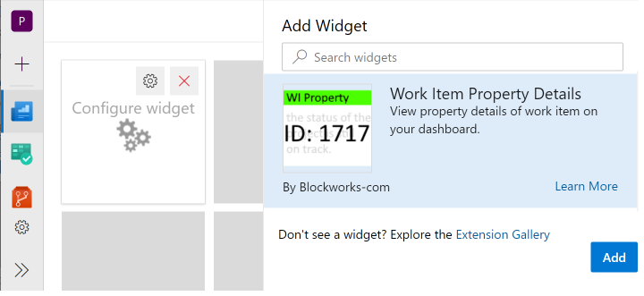

This is a fork of https://github.com/ALM-Rangers/Work-Item-Details-Widget-Extension with the ability to show a specific property.

Requires using Typescript 2.3.4

## Work Item Property Widget ##

The **Work Item Property Widget** displays a card showing the property selected on your dashboards. You select the work item and which property to display.

There are times when you have a parent or central work item that contains information that you want displayed on multiple dashboards. Instead of adding static content to each dashboard, this widget allows you to display information from the work item and then maintain the information in one location. 

## Use Cases

### Project Overview / Product Vision
You have a work item that contains an overview of the project. This might be a product vision that is shared across multiple teams and/or multiple projects. Display the project overview or product vision on many dashboards, while still only maintaining the content in the single work item. 

### Project Status
You have a Project work item that contains current status for a status report. Instead of maintaining the status separately, maintain it in the Project work item and display the status on the dashboard with other key information, such as burndown, so it's available for everyone on the team to view.

### Fill Title with Status Color
Your widget displays the progress for the project and you also have a progress-color property. Instead of have a separate widget displaying the progress-color, show it with the progress. After selecting the work item id and propery field then also select progress-color property for the Title Status Color. The background color of the Title is set to the specified property. Only the background of the title is set and the remainder of the widget is unaffected. 

### (New) Target Date
In the latest version of this widget, you can now specify the date format to display a date field. This is typically used when you want to display your Target Date or Go-Live Date on the dashboard. It uses the standard javascript formats, such as 'MMM DD YYYY'. The date format option only applies if the selected property is a date.

## Quick steps to get started

### Method 1

- Edit your dashboard
- Select the 'Work Item Property' widget
- Click Add to add the widget to your dashboard
- Click Configure on the widget

- Enter a Work Item Id and tab out of the text box.
- Enter a Title to display (at the top of the widget) and tab out of the text box.
- Select a Property Name and tab out of the dropdown.
- (Optional) Select a Title Status Color Property Name (background color for the Title) and tab out of the dropdown. For example, this could be the status color for the project.
- (Optional) Enter a Color to set the background color for the entire widget and tab out of the text box.
- (Optional) Enter a Date Format to format the widget context if it's a date and tab out of the text box. For example, use MMM DD YYYY to format the Target Go Live property.
- Click on Save

### Method 2

- Select the context menu "..." on any work item list, work item dialog, or board
- Select the item 'Add Property Widget to dashboard'
- Select the desired dashboard

### Notes

- You can select multiple work items in a list
- On the dashboard, click on the widget to open the work item in a modal form 

## Privacy
Please note that personal and confidential information is only saved in your Azure DevOps account using the built-in Azure DevOps data storage service "Team Services ExtensionDataService". You find more information about that service at Microsoft Docs: Azure DevOps Data storage.

We also collect some telemetry data using Application Insights ("AI"). As part of AI telemetry collection the standard AI telemetry data (Microsoft Docs: Data collection, retention and storage in Application Insights) as well as the (Azure DevOps/TFS) account name and Team Project id is tracked. Telemetry is enabled by default to capture feature usage. Feature usage tracking only logs which feature is used and not the values used. For example if the widget is configured with a date format, the use of Date Format is tracked but not the actual value entered. Exceptions are also logged for troubleshooting purposes. You can review the code if you have concerns about what is logged.

## Notices
Notices for certain third party software included in this solution are provided here: [Third Party Notice](ThirdPartyNotices.txt).

## Contribute
All contributions from the GitHub community are welcome.

- Submit bugs and help us verify fixes  
- Submit pull requests for bug fixes and features and discuss existing proposals   
- Fork the repository
- Create a feature branch: `git checkout -b new-feature`
- Commit your changes
- Push to the branch: `git push origin new-feature`
- Submit a Pull Request

Please refer to [Contribution guidelines](.github/CONTRIBUTING.md) and the [Code of Conduct](.github/COC.md) for more details.
