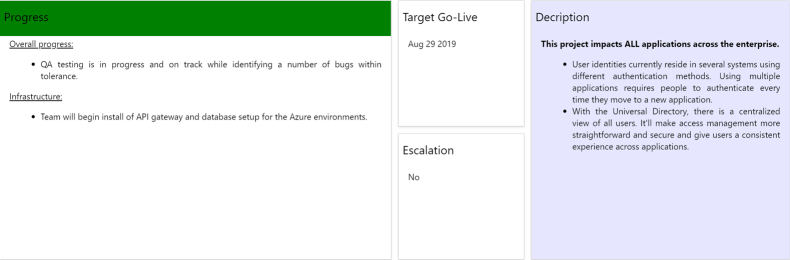
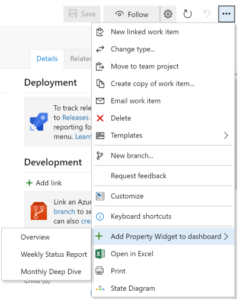

## Work Item Property Widget ##

The **Work Item Property Widget** displays a card showing the property selected on your dashboards.

## Quick steps to get started

### Method 1

- Edit your dashboard
- Select the 'Work Item Property' widget
- Click Add to add the widget to your dashboard
- Click Configure on the widget

- Enter a Work Item Id and tab out of the text box.
- Enter a Title to display (at the top of the widget) and tab out of the text box.
- Select a Property Name and tab out of the dropdown.
- (Optional) Select a Title Status Color Property Name (background color for the Title) and tab out of the dropdown. For example, this could be the status color for the project.
- (Optional) Enter a Color to set the background color for the entire widget and tab out of the text box.
- (Optional) Enter a Date Format to format the widget context if it's a date and tab out of the text box. For example, use MMM DD YYYY to format the Target Go Live property.
- Click on Save

### Method 2

- Select the context menu "..." on any work item list, work item dialog, or board
- Select the item 'Add Property Widget to dashboard'
- Select the desired dashboard

### Notes

- You can select multiple work items in a list
- On the dashboard, click on the widget to open the work item in a modal form 

## Privacy
Please note that personal and confidential information is only saved in your Azure DevOps account using the built-in Azure DevOps data storage service "Team Services ExtensionDataService". You find more information about that service at Microsoft Docs: Azure DevOps Data storage.

We also collect some telemetry data using Application Insights ("AI"). As part of AI telemetry collection the standard AI telemetry data (Microsoft Docs: Data collection, retention and storage in Application Insights) as well as the (Azure DevOps/TFS) account name and Team Project id is tracked. Telemetry is enabled by default to capture feature usage. Feature usage tracking only logs which feature is used and not the values used. For example if the widget is configured with a date format, the use of Date Format is tracked but not the actual value entered. Exceptions are also logged for troubleshooting purposes. You can review the code if you have concerns about what is logged.

## Notices
Notices for certain third party software included in this solution are provided here: [Third Party Notice](ThirdPartyNotices.txt).

## Contribute
All contributions from the GitHub community are welcome.

- Submit bugs and help us verify fixes  
- Submit pull requests for bug fixes and features and discuss existing proposals   
- Fork the repository
- Create a feature branch: `git checkout -b new-feature`
- Commit your changes
- Push to the branch: `git push origin new-feature`
- Submit a Pull Request

Please refer to [Contribution guidelines](.github/CONTRIBUTING.md) and the [Code of Conduct](.github/COC.md) for more details.
